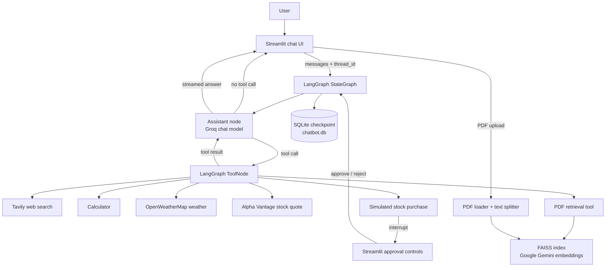
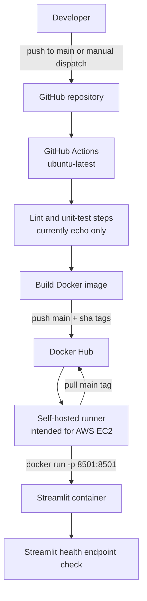
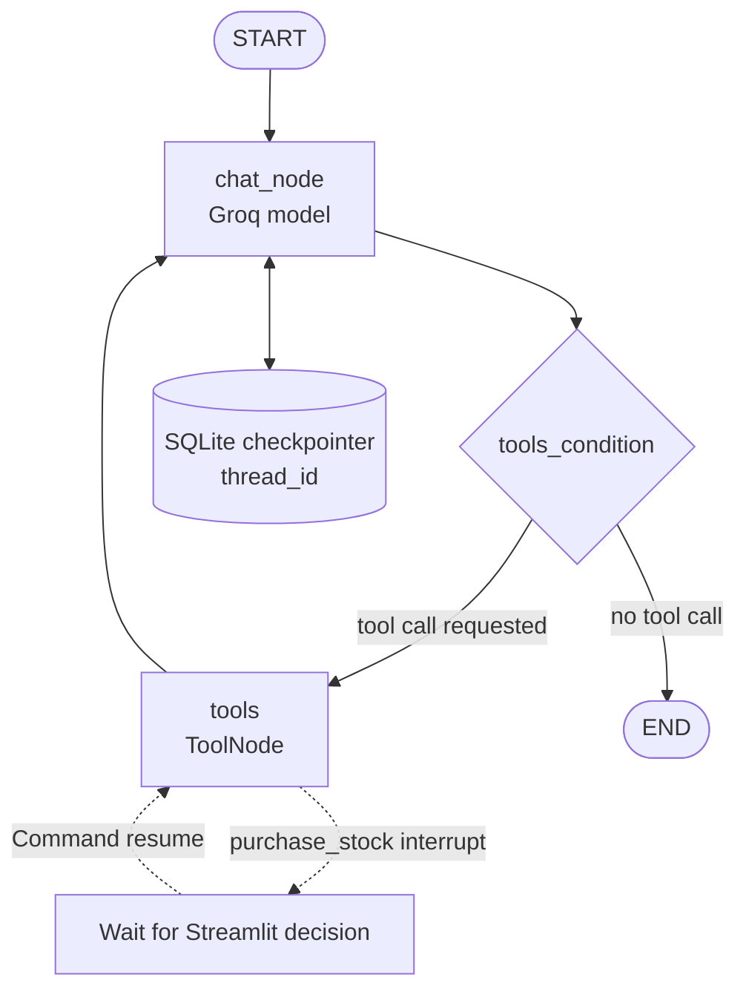

# 🤖 Agentic Chatbot with LangGraph

### A tool-using conversational assistant with document retrieval and human-approved actions

[](https://www.python.org/)
[](https://streamlit.io/)
[](https://www.langchain.com/langgraph)
[](https://www.docker.com/)
[](LICENSE)
[](https://github.com/Raj110123/Agentic-Chatbot-using-LangGraph/actions/workflows/cicd.yaml)

> This project is a Streamlit chat application backed by a LangGraph agent. The assistant can answer directly or choose from web search, calculations, stock quotes, current weather, and retrieval from an uploaded PDF. Conversations are checkpointed in SQLite, and a simulated stock purchase pauses for explicit approval in the UI before it can continue.

---

## 📚 Table of contents

- [Project overview](#-project-overview)
- [Key features](#-key-features)
- [Technology stack](#-technology-stack)
- [Architecture](#-architecture)
- [How it works](#-how-it-works)
- [Agent and LangGraph workflow](#-agent-and-langgraph-workflow)
- [Project structure](#-project-structure)
- [Getting started](#-getting-started)
- [Configuration and secrets](#-configuration-and-secrets)
- [Run with Docker](#-run-with-docker)
- [CI/CD and AWS deployment](#-cicd-and-aws-deployment)
- [Data and persistence](#-data-and-persistence)
- [Current scope and operational notes](#-current-scope-and-operational-notes)
- [Contributing](#-contributing)
- [License](#-license)

## 🌐 Project overview

Many chat interfaces only send a prompt to a model and display its reply. This project demonstrates a more extensible pattern: a model can decide when a request needs an external tool, receive that tool's result, and then return a natural-language answer. LangGraph coordinates that loop and persists thread state, while Streamlit provides the chat experience.

The application is useful as a learning project or a starting point for experimenting with:

- Tool-enabled conversations, including web search, arithmetic, weather, and stock quotes.
- Asking questions about the content of an uploaded PDF using retrieval-augmented generation (RAG).
- Human-in-the-loop control for an action that should not proceed automatically.
- Stateful conversations that can be revisited from the sidebar.
- Building and deploying the Streamlit app as a Docker container.

At a high level, a user message enters the Streamlit UI and is sent to the LangGraph workflow. The model either responds directly or requests a tool. Tool results are fed back through the model before the answer is streamed to the chat. A purchase request is the exception to an uninterrupted tool loop: it pauses for a user decision and resumes on the same conversation thread.

## ✨ Key features

| Feature | What it does | Implementation |
|---|---|---|
| 🧠 Tool-aware assistant | Answers general questions directly and can request tools when appropriate. | Groq-hosted chat model (`openai/gpt-oss-20b`) connected to LangGraph tools through LangChain. |
| 🔀 Agent workflow | Routes between the assistant and tool execution until the model is ready to answer. | LangGraph `StateGraph`, `ToolNode`, and `tools_condition`. |
| 🔎 Web search | Searches the web for current or recent information. | `TavilySearch`, configured for up to five results with advanced search depth. |
| 📄 PDF question answering | Accepts a PDF through the chat input, splits and embeds its text, and retrieves relevant passages for questions. | `PyPDFLoader`, `RecursiveCharacterTextSplitter`, Google Gemini embeddings, and a local FAISS index. |
| 🧮 Calculator | Evaluates common mathematical expressions, including supported `math` functions. | A LangChain tool implemented in Python. |
| 🌦️ Current weather | Resolves a location and fetches current weather in metric units. | OpenWeatherMap geocoding and current-weather endpoints. |
| 📈 Stock quote lookup | Looks up a symbol using the Alpha Vantage Global Quote endpoint. | A LangChain tool implemented with `requests`. |
| 🧑‍⚖️ Human approval | Pauses a simulated stock purchase and resumes after the user approves or rejects it. | LangGraph `interrupt()` / `Command(resume=...)` and Streamlit approval controls. This does **not** place a real brokerage order. |
| 💬 Threaded chat history | Starts new chats, switches between threads, and restores saved messages. | Streamlit session state and LangGraph's SQLite checkpointer (`chatbot.db`). |
| 📦 Containerized app | Builds and runs the Streamlit application in a Python container. | Docker and the repository's `Dockerfile`. |
| 🚀 Automated image deployment | Builds and pushes an image, then deploys it to a self-hosted runner after the prior job succeeds. | GitHub Actions, Docker Hub, and a self-hosted runner intended for AWS EC2. |

## 🧰 Technology stack

| Category | Technology | Purpose in this project |
|---|---|---|
| Language | Python 3.11 (Docker base image) | Application and backend logic. |
| User interface | Streamlit | Chat UI, PDF upload, conversation sidebar, streaming output, and approval buttons. |
| Agent orchestration | LangGraph | Defines the assistant/tool loop and supports resumable interrupts. |
| LLM integration | LangChain | Chat messages, tool definitions, model binding, document loading, and retrieval components. |
| Chat model | Groq — `openai/gpt-oss-20b` | Generates assistant responses and tool calls. The model is selected through `ChatGroq`. |
| Embeddings | Google Gemini — `gemini-embedding-001` | Embeds PDF text chunks for similarity search. |
| Web search | Tavily | Provides search results to the assistant. |
| Weather data | OpenWeatherMap | Geocodes a location and returns current weather data. |
| Stock quotes | Alpha Vantage Global Quote API | Returns quote data for a requested stock symbol. |
| PDF processing | `pypdf` via `PyPDFLoader` | Loads text and page metadata from an uploaded PDF. |
| Text splitting | `RecursiveCharacterTextSplitter` | Splits loaded document text into 1,000-character chunks with 200-character overlap. |
| Vector search | FAISS (`faiss-cpu`) | Stores and retrieves PDF embeddings locally; the retriever requests four similar chunks. |
| Conversation persistence | SQLite and `langgraph-checkpoint-sqlite` | Stores graph checkpoints keyed by conversation thread ID. |
| HTTP client | `requests` | Calls the weather and stock quote APIs. |
| Containerization | Docker | Packages the app and exposes Streamlit on port `8501`. |
| CI/CD | GitHub Actions | Runs the configured workflow, builds/pushes an image, and deploys it on a self-hosted runner. |
| Container registry | Docker Hub | Stores the `main` and commit-specific image tags produced by the workflow. |
| Hosting target | AWS EC2 self-hosted runner | The deployment job targets a runner labelled `self-hosted`; it is named for AWS EC2 in the workflow. |
| Tracing configuration | LangSmith environment variables | The deployment workflow validates and passes LangSmith tracing settings to the container. |

### Why these technologies?

- **LangGraph** makes the agent loop explicit: a typed message state flows through an assistant node and, when requested, a tool node. Its SQLite checkpointer also gives each chat thread recoverable state, including pending interrupts.
- **LangChain** supplies the common interfaces that connect the chat model, tools, document loader, splitter, embeddings, and retriever.
- **Streamlit** keeps the interaction in a single Python application while supporting streamed answers, file input, and human approval controls.
- **FAISS with local embeddings** provides a compact, local vector index for the uploaded PDF rather than relying on a separately provisioned vector database.
- **Docker and GitHub Actions** provide the repository's packaging and deployment path. The workflow builds in GitHub-hosted infrastructure and runs the deployment job on a separately configured self-hosted runner.

## 🏗️ Architecture

### Application architecture



The graph can call any bound tool; the diagram shows the available integrations rather than a fixed tool-selection order. Only the simulated purchase tool pauses for a human decision.

### Deployment architecture



The workflow does not provision an EC2 instance, install/configure its runner, open network ports, or create Docker Hub credentials. Those are deployment prerequisites that must be configured outside this repository. The deployment job verifies the container and Streamlit health endpoint from the runner.

## 🔄 How it works

1. **A conversation starts.** Streamlit assigns a UUID thread ID and presents the chat input. The sidebar can start another conversation or select a saved thread.
2. **The user submits a message.** The UI records the message and calls `chatbot.stream()` with the current thread ID and a `HumanMessage`.
3. **The graph updates its state.** LangGraph adds the new message to the `messages` state channel, whose reducer is `add_messages`, and invokes the assistant node.
4. **The model chooses a response path.** The Groq chat model receives the system instructions and conversation messages. It can answer directly or return a tool call.
5. **Requested tools run.** LangGraph's `ToolNode` executes the selected tool. The UI displays tool activity while assistant text is streamed.
6. **Tool results return to the model.** A conditional edge sends tool calls to the tool node; after execution, the graph loops back to the assistant node to produce a response.
7. **A purchase request can pause.** The simulated purchase tool raises a LangGraph interrupt. Streamlit displays Approve/Reject controls and resumes the same thread with the user's decision.
8. **The answer and graph state persist.** The assistant output is shown in the chat, while the SQLite checkpointer saves graph state for that thread.

For PDF questions, the user can attach a PDF in the chat input. The app indexes the first uploaded file, then the assistant can call the retrieval tool to find relevant passages before answering.

## 🧭 Agent and LangGraph workflow

The graph is a small, cyclic `StateGraph`:

- **State — `ChatState`:** a `messages` list of LangChain `BaseMessage` values, annotated with the `add_messages` reducer.
- **`chat_node`:** prepends the assistant's tool-use instructions, combines them with the current messages, calls the tool-bound Groq model, and returns its response message.
- **`tools`:** a LangGraph `ToolNode` containing the Tavily search, calculator, stock quote, weather, PDF retrieval, and simulated purchase tools.
- **Conditional routing:** `tools_condition` inspects the assistant response. If it contains a tool call, execution moves to `tools`; otherwise it routes to `END`.
- **Tool loop:** the `tools` node returns tool messages to the shared state, then an edge routes execution back to `chat_node`.
- **Persistence:** `SqliteSaver` is attached when the graph is compiled. The app supplies a `thread_id` in the graph config so checkpoints belong to the correct conversation.
- **Interrupt/resume:** `purchase_stock` calls `interrupt()` before returning a result. The app checks the saved state for a pending interrupt, then resumes with `Command(resume="yes")` or `Command(resume="no")`.



## 🗂️ Project structure

```text
Agentic-Chatbot-using-LangGraph/
├── app.py                       # Streamlit chat UI, threads, PDF upload, approval/resume
├── backend.py                   # LangGraph, model, tools, PDF indexing, SQLite checkpointer
├── requirements.txt             # Python dependencies
├── Dockerfile                   # Streamlit container build and startup command
├── .dockerignore                # Excludes local Python virtual environments from build context
├── .gitignore                   # Ignores local environments, .env, and generated files
├── LICENSE                      # Apache License 2.0
├── README.md                    # Project documentation
├── .github/
│   └── workflows/
│       └── cicd.yaml            # CI placeholder, Docker Hub publishing, self-hosted deployment
└── .vscode/
    └── settings.json            # Workspace Python environment preferences
```

Runtime data is created alongside the application: `chatbot.db` holds conversation checkpoints and `faiss_db/` holds the local PDF vector index. Neither is checked in as a project source file.

## 🚀 Getting started

### Prerequisites

- Python 3.11 recommended (the Docker image uses `python:3.11-slim`).
- API credentials for the integrations you intend to use. See [Configuration and secrets](#-configuration-and-secrets).
- Internet access for the hosted model and external API-backed tools.

### Run locally

1. Clone the repository and enter its directory:

   ```bash
   git clone https://github.com/Raj110123/Agentic-Chatbot-using-LangGraph.git
   cd Agentic-Chatbot-using-LangGraph
   ```

2. Create and activate a virtual environment:

   ```bash
   python -m venv .venv
   ```

   Activate it using the command for your shell:

   ```powershell
   # Windows PowerShell
   .\.venv\Scripts\Activate.ps1
   ```

   ```bash
   # macOS / Linux
   source .venv/bin/activate
   ```

3. Install the dependencies:

   ```bash
   python -m pip install -r requirements.txt
   ```

4. Create a local `.env` file and add the credentials required for the integrations you want to use.
5. Start Streamlit:

   ```bash
   streamlit run app.py
   ```

6. Open the local URL printed by Streamlit (normally `http://localhost:8501`).

## 🔐 Configuration and secrets

`backend.py` calls `load_dotenv()`, so local development can load values from a root-level `.env` file. `.env` is excluded from Git; there is no checked-in `.env.example`.

| Variable | Used for | Required when |
|---|---|---|
| `GROQ_API_KEY` | Chat model selected by `ChatGroq`. | Running the assistant. |
| `GOOGLE_API_KEY` | Google Gemini embeddings used when indexing an uploaded PDF. | PDF ingestion/retrieval. |
| `TAVILY_API_KEY` | Tavily web search. | Web search. |
| `OPENWEATHER_API_KEY` | OpenWeatherMap geocoding and current weather requests. | Weather queries. |
| `LANGSMITH_TRACING` | LangSmith tracing configuration passed through to the runtime. | Tracing, if enabled. |
| `LANGSMITH_ENDPOINT` | LangSmith endpoint configuration passed through to the runtime. | Tracing, if enabled. |
| `LANGSMITH_API_KEY` | LangSmith authentication configuration passed through to the runtime. | Tracing, if enabled. |
| `LANGSMITH_PROJECT` | LangSmith project configuration passed through to the runtime. | Tracing, if enabled. |
| `OPENAI_API_KEY` | Passed into the container by the deployment workflow. The current backend selects `ChatGroq` and does not read this variable. | Not required by the current backend. |

For example, a local `.env` can contain:

```dotenv
GROQ_API_KEY=your_groq_api_key
GOOGLE_API_KEY=your_google_api_key
TAVILY_API_KEY=your_tavily_api_key
OPENWEATHER_API_KEY=your_openweathermap_api_key

# Optional LangSmith tracing configuration
LANGSMITH_TRACING=false
LANGSMITH_ENDPOINT=
LANGSMITH_API_KEY=
LANGSMITH_PROJECT=
```

Only provide real credentials in local environment configuration or your secret manager. The GitHub Actions deployment workflow requires `GOOGLE_API_KEY`, `GROQ_API_KEY`, `TAVILY_API_KEY`, `OPENWEATHER_API_KEY`, and all four `LANGSMITH_*` secrets during its validation step. It also uses `DOCKER_USERNAME`, `DOCKER_PASSWORD`, and `IMAGE_NAME` for Docker Hub. Configure these under the repository's GitHub Actions secrets.

> **Credential note:** The stock quote tool currently embeds its Alpha Vantage credential in `backend.py` rather than reading an environment variable. Move that credential to a secret/environment variable and rotate it before using the integration in a public or production deployment.

## 🐳 Run with Docker

Build and run the app from the repository root:

```bash
docker build -t agentic-chatbot .
docker run --rm -p 8501:8501 --env-file .env agentic-chatbot
```

Then open `http://localhost:8501`. The container listens on port `8501`; its startup command binds Streamlit to `0.0.0.0`.

The current `.dockerignore` excludes virtual-environment directories but does **not** exclude `.env`. Because the Dockerfile copies the project into the image, do not build from a context containing real secrets unless `.dockerignore` has first been updated to exclude them. For deployed containers, inject secrets at runtime rather than baking them into the image.

## ⚙️ CI/CD and AWS deployment

The workflow in `.github/workflows/cicd.yaml` is named **Streamlit AWS CI/CD**. It runs on pushes to `main` except changes limited to `README.md`, and can also be started manually with `workflow_dispatch`. A concurrency group cancels an in-progress run when a newer production deployment starts.

The workflow has three dependent jobs:

1. **Continuous Integration (`ubuntu-latest`)** checks out the repository. The current “Lint code” and “Run unit tests” steps only print messages; they do not run a linter or test suite.
2. **Build and Push Docker Image (`ubuntu-latest`)** validates Docker Hub username and image name secrets, builds with Docker Buildx, then pushes both `:main` and `:sha-<commit>` tags.
3. **Deploy to AWS EC2 (`self-hosted`)** logs in to Docker Hub, validates application secrets, pulls the `:main` image, replaces the container named `stapp`, and runs it with port `8501` published and `--restart unless-stopped`. It checks that the container is running and polls Streamlit's `/_stcore/health` endpoint. Logs are printed and unused Docker images are pruned in final steps.

The workflow assumes a configured self-hosted GitHub Actions runner with Docker access. It does not create or configure EC2, the runner, network/firewall rules, or DNS. To reach the app remotely, the host's network must allow access to the published port.

## 💾 Data and persistence

- **Conversation state:** LangGraph checkpoints are written to `chatbot.db` in the app's working directory. Thread IDs let the UI retrieve saved graph messages and pending interrupts.
- **PDF index:** Uploaded PDF pages are chunked and embedded into the local `faiss_db/` directory. The app uses one local index path and saves each ingestion there; it does not implement a managed or multi-tenant document store.
- **Container lifecycle:** The deployment workflow removes and recreates `stapp` without mounting a volume. Files written inside that container—including the SQLite database and FAISS index—are not preserved when the container is replaced. Configure durable storage separately if deployed chat history or PDF indexes must survive deployments.

## 📝 Current scope and operational notes

- The purchase tool is a **simulation** guarded by approval; it does not interact with a brokerage or place real trades.
- The chat model is currently configured as `openai/gpt-oss-20b` through `ChatGroq`; despite the model identifier's name, the active client in this code is Groq.
- The chat UI processes the first attached PDF on a submission. It does not expose document management or a persistent multi-file library.
- No application tests or dedicated lint configuration are present in the tracked project files. The workflow's corresponding steps are placeholders, not quality gates.
- Deployment depends on repository secrets and an online self-hosted runner. The workflow's name identifies AWS EC2 as its target, but infrastructure provisioning is outside the workflow.

## 🤝 Contributing

Contributions are welcome. For changes to the application or deployment:

1. Open an issue or describe the behavior you plan to change.
2. Keep credentials out of source, commits, and Docker images.
3. Update this README when setup steps, tools, configuration, or deployment behavior changes.
4. Run the app locally and validate the affected integration where credentials are available. The current CI workflow does not run actual tests or linting.

## 📄 License

This project is licensed under the [Apache License 2.0](LICENSE).
